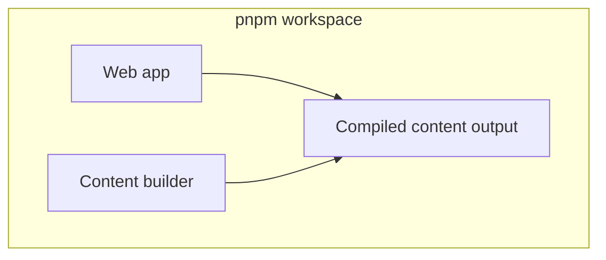
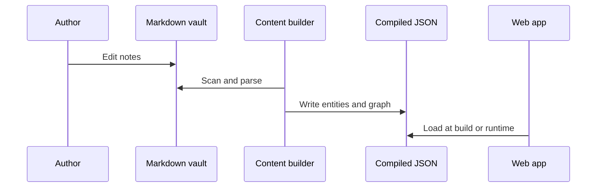

# Galipette App

This repository is a pnpm workspace that hosts a web client and supporting packages. Shared tooling compiles authored Markdown content into JSON consumed by the application, keeping runtime bundles free of parsers and keeping gameplay data auditable in source control.

## Quick links

| Package | README |
|---------|--------|
| `@galipette/content-builder` | [packages/content-builder/README.md](packages/content-builder/README.md) |
| `@galipette/compiled-content` | [packages/compiled-content/README.md](packages/compiled-content/README.md) |
| `@galipette/content-schema` | [packages/content-schema/README.md](packages/content-schema/README.md) |
| Web app | [apps/web/README.md](apps/web/README.md) |

## Layout

At the top level you will find applications under one folder name pattern and reusable libraries under another. Compiled output from the content pipeline is written into a dedicated package folder so multiple consumers can depend on one artifact without copying files.

## Content workflow

Authors maintain notes in an Obsidian vault layout. The content builder scans a chosen subfolder, validates entities, resolves cross-references for graphs, and emits JSON. The web application reads those artifacts as static data through the `@galipette/compiled-content` package — never re-parsing Markdown — and exposes a TanStack Router-powered explorer where every entity is reachable through a URL that mirrors its `sourcePath`.

## Commands

Use the package manager configured for this workspace to install dependencies from the repository root. Build and test scripts are namespaced per package; refer to each package directory for what it contributes. The root package forwards common tasks such as building compiled content and running package-level tests so you do not need to change directory for day-to-day work.

## Contributing

Keep behavioral changes covered by the content builder test suite when touching validation or graph logic. Prefer extending schemas and registries over branching special cases in the core pipeline.
