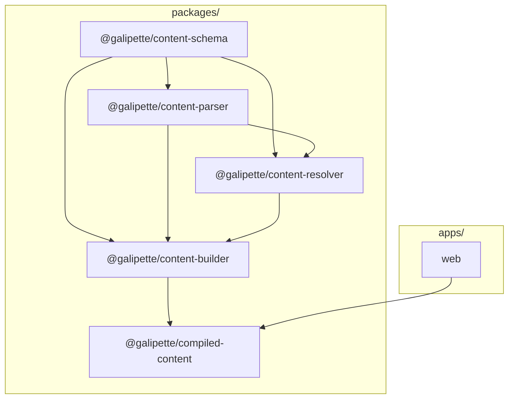
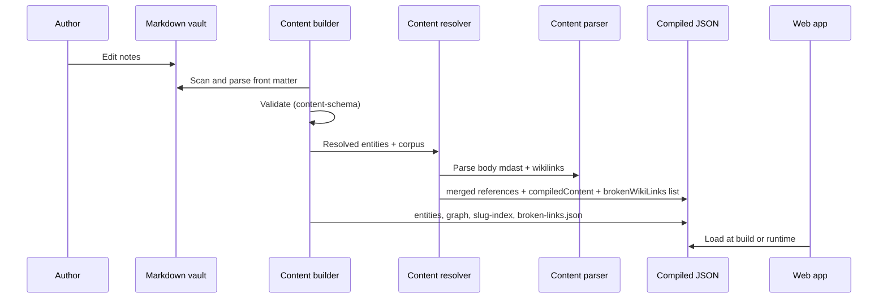

# Galipette App

This repository is a pnpm workspace that hosts a web client and supporting packages. Shared tooling compiles authored Markdown content into JSON consumed by the application, keeping runtime bundles free of parsers and keeping gameplay data auditable in source control.

The content stack is split by concern: **schemas** define shared shapes, **parser** turns Markdown into mdast (wikilinks, no positions in output), **resolver** merges references and attaches `compiledContent`, **builder** scans the vault and orchestrates validation plus writes, and **compiled-content** is the read-only surface the web app imports.

## Quick links

| Package                           | README                                                                     |
| --------------------------------- | -------------------------------------------------------------------------- |
| `@galipette/content-schema`       | [packages/content-schema/README.md](packages/content-schema/README.md)     |
| `@galipette/content-parser`       | [packages/content-parser/README.md](packages/content-parser/README.md)     |
| `@galipette/content-resolver`     | [packages/content-resolver/README.md](packages/content-resolver/README.md) |
| `@galipette/content-builder`      | [packages/content-builder/README.md](packages/content-builder/README.md)   |
| `@galipette/compiled-content`     | [packages/compiled-content/README.md](packages/compiled-content/README.md) |
| `@galipette/database`             | [packages/database/README.md](packages/database/README.md)                 |
| `@galipette/shared-schemas`       | [packages/shared-schemas/README.md](packages/shared-schemas/README.md)     |
| Web app                           | [apps/web/README.md](apps/web/README.md)                                   |
| HTTP API (characters CRUD)        | [apps/api/README.md](apps/api/README.md)                                   |
| Database operations (cheat sheet) | [docs/database-cheatsheet.md](docs/database-cheatsheet.md)                 |
| Changelog                         | [CHANGELOG.md](CHANGELOG.md)                                               |

## Layout

Applications live under `apps/`; reusable libraries under `packages/`. The content pipeline builds TypeScript packages in dependency order, then the builder emits JSON into `packages/compiled-content` so consumers share one artifact location.

## Content workflow

Authors maintain notes in an Obsidian vault layout. The **content builder** scans a chosen subfolder, validates each file against **content-schema**, then **content-resolver** (using **content-parser** / Remark) produces `compiledContent` and merged `references`, plus a flat **`brokenWikiLinks`** report for debugging. The builder then writes **`entities.json`**, **`graph.json`**, **`slug-index.json`**, and **`broken-links.json`** (same directory). The web application loads artifacts through **compiled-content** — it does not re-parse Markdown for resolved entities — and exposes a TanStack Router explorer where entity detail URLs use each note’s public **`slug`** (path derived from the vault file, without `.md`). Unresolved in-body wikilinks in the UI link to **`/not-found`** with search params carrying operand context.

## Commands

From the repository root, after `pnpm install`:

| Script                        | Purpose                                                                                                                                                                                      |
| ----------------------------- | -------------------------------------------------------------------------------------------------------------------------------------------------------------------------------------------- |
| `pnpm build:content`          | Builds the full content chain in order: **schema** → **parser** → **resolver** → **builder** (runs the builder CLI against your configured vault) → **compiled-content** TypeScript package. |
| `pnpm build:content-schema`   | TypeScript build for `@galipette/content-schema` only.                                                                                                                                       |
| `pnpm build:content-parser`   | TypeScript build for `@galipette/content-parser` only.                                                                                                                                       |
| `pnpm build:content-resolver` | TypeScript build for `@galipette/content-resolver` only.                                                                                                                                     |
| `pnpm build:content-builder`  | Runs the content builder package entry (vault → JSON).                                                                                                                                       |
| `pnpm build:compiled-content` | TypeScript build for `@galipette/compiled-content` only.                                                                                                                                     |
| `pnpm build:database`         | `prisma generate` + TypeScript build for `@galipette/database`.                                                                                                                              |
| `pnpm build:shared-schemas`   | TypeScript build for `@galipette/shared-schemas` (run after `build:database` when the Prisma schema changed).                                                                                |
| `pnpm db:generate`            | Regenerate Prisma Client in `@galipette/database`.                                                                                                                                           |
| `pnpm db:validate`            | Validate `schema.prisma` (no DB connection required).                                                                                                                                        |
| `pnpm db:migrate`             | `prisma migrate dev` in `@galipette/database` (requires `DATABASE_URL` in `apps/api/.env`).                                                                                                |
| `pnpm db:deploy`              | `prisma migrate deploy` — apply pending migrations (CI/production).                                                                                                                          |
| `pnpm db:push`                | `prisma db push` — prototype sync without migration files (local only).                                                                                                                      |
| `pnpm db:studio`              | Open Prisma Studio for the configured database.                                                                                                                                              |
| `pnpm db:status`              | `prisma migrate status` — migration drift / history.                                                                                                                                         |
| `pnpm test:content`           | Runs tests for schema, content-builder, and compiled-content.                                                                                                                                |
| `pnpm dev`                    | Starts the web app.                                                                                                                                                                          |
| `pnpm dev:api`                | Starts the Hono API on port **3001** (override with `PORT`).                                                                                                                                 |
| `pnpm build:api`              | TypeScript build for `apps/api`.                                                                                                                                                             |
| `pnpm generate:openapi`       | Writes `packages/shared-schemas/openapi/galipette-api.yaml` from the live route registry.                                                                                                    |

Package-level scripts and CLI flags (vault path, subfolder, env) are documented in [packages/content-builder/README.md](packages/content-builder/README.md). Database workflows (migrations, SQL, Studio) are summarized in [docs/database-cheatsheet.md](docs/database-cheatsheet.md).

## Contributing

Keep behavioral changes covered by the **content-builder** test suite when touching validation, graph output, resolver behavior, or **`broken-links.json`** output. Prefer extending **content-schema** registries over special-casing the pipeline. Changes to Remark wikilink parsing belong in **content-parser**; orchestration, merged `references`, and the **`brokenWikiLinks`** aggregate belong in **content-resolver**. For database schema or migration changes, follow [docs/database-cheatsheet.md](docs/database-cheatsheet.md) and record notable workspace updates in [CHANGELOG.md](CHANGELOG.md).
