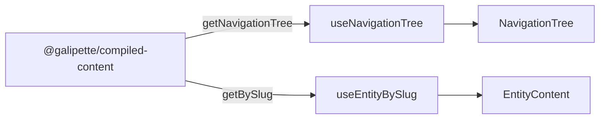

# Web app

Minimal MVP that validates the [`@galipette/compiled-content`](../../packages/compiled-content/README.md) pipeline by exposing every compiled entity through a TanStack Router-powered explorer.

## Stack

- **React 19** + **TypeScript**
- **Vite** (dev server / bundler)
- **TanStack Router** (code-based routes; entity detail uses a splat on **slug**)
- **Compiled mdast** (`entity.compiledContent`) rendered via small React components (paragraphs, headings, text, wikilinks, thematic breaks, and a generic fallback for other mdast nodes)
- **react-markdown** (fallback only when an entity has no `compiledContent`)

## Routes

| Path | Component | Purpose |
|------|-----------|---------|
| `/` | `HomePage` | Welcome screen + per-type entity counts |
| `/entity/<slug>` | `EntityPage` | Resolves the entity by **`CompiledEntity.slug`** and renders metadata + compiled body |
| `/not-found` | `not-found` route | Optional **`?operand=`** / **`?link=`** search params (used when opening an unresolved wikilink from entity content) |

The entity route uses a TanStack splat (`entity/$`) so the full **slug** (e.g. `wiki/skills/spells/lightning-arc`, no `.md` suffix) is represented as URL path segments, each segment URL-encoded where needed.

## Source layout

```
src/
├── components/        # Presentational + page components
│   ├── AppLayout.tsx
│   ├── CompiledMdast.tsx   # mdast → React (wikilinks, headings, …)
│   ├── EntityContent.tsx
│   ├── EntityLink.tsx
│   ├── EntityPage.tsx
│   ├── EntityTypeSection.tsx
│   ├── HomePage.tsx
│   ├── NavigationTree.tsx
│   └── NotFound.tsx
├── hooks/             # Reusable React hooks over the content repository
│   ├── useEntityBySlug.ts
│   └── useNavigationTree.ts
├── routes/            # TanStack Router route definitions (no JSX bodies)
│   ├── entity.tsx
│   ├── home.tsx
│   ├── not-found.tsx
│   └── root.tsx
├── styles/            # App-level CSS (layout, sidebar, content)
│   └── app.css
├── types/             # Shared route-level constants/types
│   └── routing.ts     # ENTITY_ROUTE_PREFIX, NOT_FOUND_ROUTE
├── utils/             # Pure helpers (formatting, slug ↔ URL splat)
│   ├── format-type-label.ts
│   └── source-path.ts # buildEntityHref(slug), decodeEntitySlug(splat)
├── index.css          # Global tokens + base typography
├── main.tsx           # Mounts <RouterProvider>
└── router.tsx         # Composes the route tree
```

Each module follows the **Single Responsibility Principle**: routes only declare URLs and bind a component, components only render, hooks only read from the content repository, utils are pure.

## Data flow



The web app never reaches into raw artifacts; it only consumes the public API of `@galipette/compiled-content`. Sidebar links use each entry’s **`slug`** to build `/entity/...` URLs. Resolved wikilinks in the body use the same **`buildEntityHref(targetEntitySlug)`**; unresolved wikilinks render as links to **`/not-found`** with search params (see `CompiledMdast.tsx`).

## Commands

```sh
# from the workspace root
pnpm --filter web dev      # start the Vite dev server (http://localhost:5173)
pnpm --filter web build    # type-check + production build
pnpm --filter web lint     # ESLint
pnpm --filter web preview  # serve the production build
```

The compiled-content package must be built (or the workspace symlink must resolve to fresh sources) before the app can read entity data:

```sh
pnpm build:compiled-content
```
