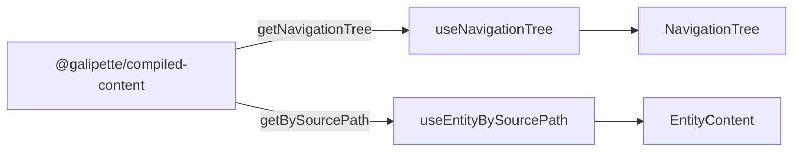

# Web app

Minimal MVP that validates the [`@galipette/compiled-content`](../../packages/compiled-content/README.md) pipeline by exposing every compiled entity through a TanStack Router-powered explorer.

## Stack

- **React 19** + **TypeScript**
- **Vite** (dev server / bundler)
- **TanStack Router** (code-based, splat route on `sourcePath`)
- **react-markdown** (renders the entity body)

## Routes

| Path | Component | Purpose |
|------|-----------|---------|
| `/` | `HomePage` | Welcome screen + per-type entity counts |
| `/entity/<sourcePath>` | `EntityPage` | Renders one entity's metadata + Markdown body |

The detail route uses a TanStack splat (`entity/$`) so the entity's full `sourcePath` (e.g. `wiki/skills/spells/lightning-arc.md`) is preserved verbatim in the URL.

## Source layout

```
src/
├── components/        # Presentational + page components
│   ├── AppLayout.tsx
│   ├── EntityContent.tsx
│   ├── EntityLink.tsx
│   ├── EntityPage.tsx
│   ├── EntityTypeSection.tsx
│   ├── HomePage.tsx
│   ├── NavigationTree.tsx
│   └── NotFound.tsx
├── hooks/             # Reusable React hooks over the content repository
│   ├── useEntityBySourcePath.ts
│   └── useNavigationTree.ts
├── routes/            # TanStack Router route definitions (no JSX bodies)
│   ├── entity.tsx
│   ├── home.tsx
│   └── root.tsx
├── styles/            # App-level CSS (layout, sidebar, content)
│   └── app.css
├── types/             # Shared route-level constants/types
│   └── routing.ts
├── utils/             # Pure helpers (formatting, URL <-> sourcePath)
│   ├── format-type-label.ts
│   └── source-path.ts
├── index.css          # Global tokens + base typography
├── main.tsx           # Mounts <RouterProvider>
└── router.tsx         # Composes the route tree
```

Each module follows the **Single Responsibility Principle**: routes only declare URLs and bind a component, components only render, hooks only read from the content repository, utils are pure.

## Data flow



The web app never reaches into raw artifacts; it only consumes the public API of `@galipette/compiled-content`.

## Commands

```sh
# from the workspace root
pnpm --filter web dev      # start the Vite dev server (http://localhost:5173)
pnpm --filter web build    # type-check + production build
pnpm --filter web lint     # ESLint
pnpm --filter web preview  # serve the production build
```

The compiled-content package must be built (or the workspace symlink must resolve to fresh sources) before the app can read entity data:

```sh
pnpm build:compiled-content
```
