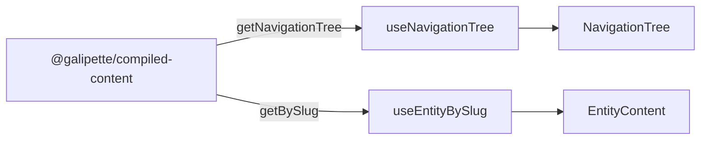

# Web app

Minimal MVP that validates the [`@galipette/compiled-content`](../../packages/compiled-content/README.md) pipeline by exposing every compiled entity through a TanStack Router-powered explorer.

## Stack

- **React 19** + **TypeScript**
- **Vite** (dev server / bundler)
- **TanStack Router** (code-based routes; entity detail uses a splat on **slug**)
- **Compiled mdast** (`entity.compiledContent`) rendered via small React components (paragraphs, headings, text, wikilinks, thematic breaks, and a generic fallback for other mdast nodes)
- **react-markdown** (fallback only when an entity has no `compiledContent`)

## Routes

| Path | Component | Purpose |
|------|-----------|---------|
| `/` | `app/pages/HomePage` | Welcome screen + per-type entity counts |
| `/entity/<slug>` | `features/wiki/pages/EntityPage` | Resolves the entity by **`CompiledEntity.slug`** and renders metadata + compiled body |
| `/not-found` | `app/routes/not-found` | Optional **`?operand=`** / **`?link=`** search params (used when opening an unresolved wikilink from entity content) |

The entity route uses a TanStack splat (`entity/$`) so the full **slug** (e.g. `wiki/skills/spells/lightning-arc`, no `.md` suffix) is represented as URL path segments, each segment URL-encoded where needed.

## Source layout (feature-first)

```
src/
├── app/                      # Shell & routing: router, layout, shell pages, route modules
│   ├── layout/
│   │   └── AppLayout.tsx       # Header, sidebar (wiki nav), `<Outlet>`
│   ├── pages/
│   │   └── HomePage.tsx        # `/` landing
│   ├── routes/                 # TanStack route definitions (URLs + bindings only)
│   │   ├── root.tsx
│   │   ├── home.tsx
│   │   ├── entity.tsx          # mounts wiki `EntityPage`
│   │   └── not-found.tsx
│   ├── styles/
│   │   └── app.css             # Layout + wiki explorer presentation (shared chrome)
│   └── router.tsx
├── features/
│   └── wiki/                   # Compiled wiki / vault explorer (entity detail, nav, mdast)
│       ├── components/         # NavigationTree, EntityContent, CompiledMdast, …
│       ├── hooks/              # `useEntityBySlug`, `useNavigationTree`
│       ├── pages/
│       │   └── EntityPage.tsx  # `/entity/$` page
│       └── utils/
│           └── source-path.ts  # slug ↔ URL splat (`buildEntityHref`, `decodeEntitySlug`)
├── common/                     # App-wide helpers not living in workspace packages
│   ├── components/
│   │   └── NotFound.tsx
│   ├── routing/
│   │   └── constants.ts        # `ENTITY_ROUTE_PREFIX`, `NOT_FOUND_ROUTE`
│   └── utils/
│       └── format-type-label.ts
├── index.css                   # Global tokens + base typography
└── main.tsx                    # Mounts `<RouterProvider>`; imports `app/router`
```

**Boundaries:** `app` owns the router and top-level routes; feature folders own domain UI and data hooks for that domain. `common` holds small shared pieces (constants, pure formatters, cross-feature UI like `NotFound`) that are not worth extracting to `packages/` yet.

Each module still follows a **single responsibility**: routes only declare URLs and bind a component; feature components focus on rendering; hooks read from the content repository; utils stay pure.

## Data flow



The web app never reaches into raw artifacts; it only consumes the public API of `@galipette/compiled-content`. Sidebar links use each entry’s **`slug`** to build `/entity/...` URLs. Resolved wikilinks in the body use the same **`buildEntityHref(targetEntitySlug)`**; unresolved wikilinks render as links to **`/not-found`** with search params (see `features/wiki/components/CompiledMdast.tsx`).

## Commands

```sh
# from the workspace root
pnpm --filter web dev      # start the Vite dev server (http://localhost:5173)
pnpm --filter web build    # type-check + production build
pnpm --filter web lint     # ESLint
pnpm --filter web preview  # serve the production build
```

The compiled-content package must be built (or the workspace symlink must resolve to fresh sources) before the app can read entity data:

```sh
pnpm build:compiled-content
```
