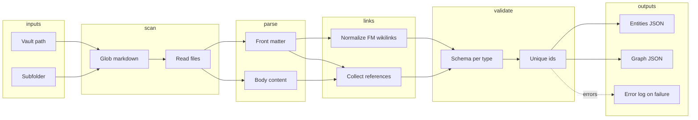

# Content builder

This package turns a folder of Obsidian-flavored Markdown notes into validated JSON that the rest of the application can load without parsing Markdown at runtime. It is meant to stay small, explicit, and easy to extend when new entity kinds appear.

## Role in the application

Game or narrative content lives in Markdown files with YAML front matter. The builder scans that tree, validates each note against a schema, resolves wiki-style links for reference tracking, and writes compiled artifacts next to the workspace packages so front-end code can import stable data only.

## Pipeline

The flow is linear: discover files, parse each note, collect link references from both front matter and the body, normalize wiki links only inside front matter values, validate with schema rules, merge duplicate detection across the whole run, then emit entity payloads plus a lightweight graph summary.

## Artifacts

Successful runs produce a dense list of entities under the shared compiled-content package area, plus a separate graph file whose nodes carry only identifiers and labels needed for visualization or navigation, and whose edges record directional references between entity ids. Failures write a Markdown report under this package so every validation issue from the full pass is visible in one place.

## Wikilink rules

Obsidian-style links use the text before the pipe when an alias is present, and the whole link text when there is no pipe. References are gathered from structured front matter and from the prose body; only front matter values are rewritten for validation. Body text is left unchanged so authoring tools and players still see the original markup.

## Operating the tool

The workspace root exposes scripts that delegate to this package. You can pass a vault path and subfolder via flags or environment variables documented in the repository overview; when arguments are missing, the CLI prompts interactively. Output paths default to the shared compiled-content location so consumers always read from one predictable directory.

## Tests

Automated checks live under the package tests folder. Helpers create temporary vault layouts so integration scenarios stay isolated from real notes. Run the workspace test script that targets this package when changing validation or graph behavior.
